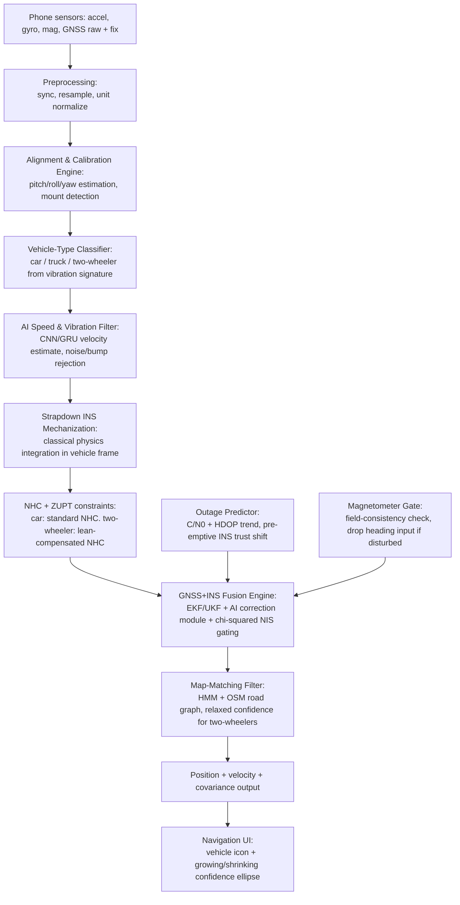

# System Architecture

## 1. Design principle

One shared **engine core** (`/engine`) implements all navigation logic. It is
sensor-agnostic: it accepts an IMU data stream (MEMS phone or FOG edge sensor),
a vehicle-type flag, and optional GNSS input, and outputs position + velocity +
covariance. Two thin consumers wrap this core:

- `/mobile` — Android app: phone sensors → engine → TFLite inference → map UI.
- `/edge` — Edge engine: external IMU (incl. FOG) → engine → position output,
  no UI, no phone-specific alignment assumptions.

The classical strapdown mechanization + EKF/UKF fusion backbone is identical
in both. What differs between MEMS and FOG paths is the **noise/correction
model**, which is swappable (see `docs/NOVELTY_SPEC.md`, section on
MEMS/FOG model sharing). This is the resolution to "same solution must work
on any IMU" without falsely claiming one trained network generalizes across
sensor grades.

## 2. End-to-end data flow (mobile path)

## 3. Module contracts (I/O — do not change without updating this file)

### Alignment & Calibration Engine
- In: raw accel/gyro/mag stream + GNSS speed (stationary + initial-drive window)
- Out: rotation matrix (phone frame → vehicle frame), confidence score
- Why GNSS speed is required: Real two-wheeler stop/start patterns in traffic produce gentle accelerations and high engine-idling vibrations that make pure-IMU stationary and acceleration detection unreliable. GNSS speed provides the external ground truth needed during the initial calibration window to cleanly isolate true stationary gravity and true forward acceleration.
- Product Constraint (GNSS-Denied Cold Start): If GNSS is unavailable during the initial calibration window (e.g., cold start inside a parking structure), the calibrator cannot confidently identify the forward axis. It will emit a confidence score of `0.0` and gracefully degrade to an identity transformation (assuming phone frame = vehicle frame), relying entirely on the downstream GNSS+INS Fusion block (Phase 6) to correct the resulting trajectory drift once GNSS is regained.
- Re-triggers: if residual misalignment error exceeds threshold during drive

### Vehicle-Type Classifier
- In: short window (few seconds) of vibration spectrum from accel/gyro
- Out: class label {car, truck, two-wheeler} + confidence
- Used to: select NHC variant, select map-matching confidence profile

### AI Speed & Vibration Filter
- In: vehicle-frame accel/gyro window
- Out: estimated forward velocity, rejected-noise mask (potholes/idling/bumps)
- Trained offline on IO-VNBD (cars) + collected/derived two-wheeler data

### Strapdown INS Mechanization
- In: bias-corrected accel/gyro, current orientation estimate
- Out: raw integrated position/velocity/attitude (pre-constraint)
- Classical physics, not learned — this is the deterministic backbone

### NHC + ZUPT (incl. lean-compensated variant)
- In: raw INS state, vehicle-type label, (two-wheeler only) estimated lean angle
- Out: constrained velocity (lateral/vertical suppressed appropriately per type)
- Two-wheeler path must estimate lean angle before applying NHC — see
  `docs/NOVELTY_SPEC.md`

### GNSS+INS Fusion Engine
- In: constrained INS state, GNSS fix (when available), outage-predictor trust
  signal, magnetometer gate flag
- Out: fused position/velocity + full covariance matrix
- Core: EKF/UKF; AI correction module adjusts process/measurement noise or
  provides learned bias correction — never replaces the filter itself
- Runs chi-squared (NIS) consistency test on every update; flags/rejects
  inconsistent updates

### Map-Matching Filter
- In: fused trajectory segment, OSM road graph
- Out: snapped position (or "no snap" if confidence too low)
- Two-wheeler profile: wider matching tolerance, explicit no-snap fallback

### Outage Predictor
- In: raw GNSS measurements (C/N0 per satellite, HDOP trend) — Android only
- Out: degrading/stable/lost signal-quality trust signal, feeds fusion engine
  ahead of hard GNSS loss

### Seamless Mode Handler
- In: GNSS availability + outage-predictor trust signal
- Out: mode state (GNSS-aided-INS vs pure-INS), transition executed within
  the millisecond-level budget defined in `docs/BENCHMARKS.md`
- This is a state machine, not a new estimator — it governs which inputs the
  fusion engine currently trusts

## 4. Edge engine path (differences from mobile)

- No alignment/calibration engine tied to phone-mount assumptions — edge IMU
  is assumed rigidly mounted; a simpler fixed-frame calibration is used instead.
- No vehicle-type classifier UI dependency — vehicle type passed as config.
- Noise/correction model swapped to the FOG-appropriate lightweight path
  (see `docs/NOVELTY_SPEC.md`).
- Output rate target ~200Hz vs mobile's 10Hz (see `docs/BENCHMARKS.md`).
- No map-matching UI, no navigation UI — position/velocity/covariance output
  only, for downstream integration.

## 5. Training vs inference split (per problem statement's hybrid workflow)

- **Training (offline, `/training`)**: AI Speed & Vibration Filter, Vehicle-Type
  Classifier, and the fusion engine's AI correction module are trained here on
  IO-VNBD + collected data. Exported to TFLite for mobile, and to a lightweight
  runtime format for edge.
- **Inference (on-device, `/engine` consumed by `/mobile` or `/edge`)**: only
  forward inference + classical filtering runs live. No training or fine-tuning
  happens on-device in this project's scope.
